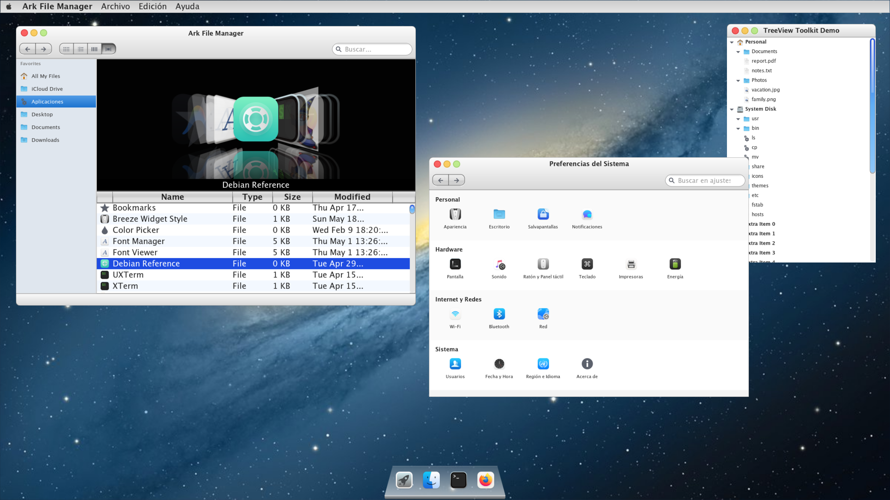

<p align="center">
  
</p>

<h1 align="center">Horizon</h1>

<p align="center">
  <strong>A graphical toolkit for Linux built entirely from scratch.</strong>
</p>

<p align="center">
  <a href="LICENSE"></a>
  
  
  
</p>

---

## 🌟 Overview

**Horizon** is a graphical toolkit for Linux built entirely from scratch, with no dependencies on GTK or Qt. Its goal is to provide a modern, lightweight alternative for building user interfaces, offering full control over rendering, widgets, and overall architecture.

Inspired by the aesthetics of classic macOS interfaces, Horizon aims to deliver a clean, elegant, and consistent user experience, reinterpreting those design principles in a modern context. It is designed for developers who want to create applications with their own identity, free from the constraints of traditional toolkits.

---

## 🎨 Philosophy

- **Minimalism & Control**: Prioritizing explicit control over memory and resources over heavy abstraction.
- **Independence**: No unnecessary dependencies; built for the Austral ecosystem.
- **Modern Rendering**: Modern, lightweight rendering engine based on Cairo (with GLES support).
- **Austral Ready**: Native support for the `.app` packaging model of Austral OS.
- **Developer-Centric**: Clear, extensible architecture that is easy to audit and learn from.

---

## 🏗️ Architecture

Horizon follows a layered design to ensure modularity and ease of maintenance:

1.  **Core**: Manages the application lifecycle, main event loop, and Wayland seat/display integration.
2.  **Renderer**: Surface abstractions and buffer management (currently utilizing Cairo with Rsvg support).
3.  **Widgets**: A growing set of components including windows, buttons, labels, and flexible layout containers.
4.  **Runtime**: Integrated support for asset management and the Austral distribution format.

---

## 🛠️ Build & Installation

Horizon is designed to be built on Linux environments using Wayland.

### 1. Prerequisites (Debian/Ubuntu)

Install the necessary development libraries and tools:

```bash
sudo apt update
sudo apt install build-essential g++ pkg-config \
                 cmake ninja-build git \
                 libwayland-dev wayland-protocols \
                 libxkbcommon-dev libcairo2-dev \
                 librsvg2-dev libpixman-1-dev \
                 libegl1-mesa-dev libgles2-mesa-dev \
                 libdbus-1-dev libvterm-dev \
                 libpipewire-0.3-dev libspa-0.2-dev \
                 nlohmann-json3-dev weston wayland-utils \
                 wlr-randr xdg-utils shared-mime-info \
                 desktop-file-utils
```

### 2. Compiling the Project

Building is straightforward using CMake and Ninja:

```bash
git clone https://github.com/yourusername/horizon.git
cd horizon
mkdir build && cd build
cmake -G Ninja ..
ninja
```

### 3. Running the Demos

To test the installation, you can run the `minimal` demo:

```bash
./minimal
```

_Note: Ensure you are in a Wayland session or running a compositor like Weston._

---

## 🌈 Customization (Themes)

Horizon supports dynamic theming via JSON configuration. You can find or create your theme at `~/.config/horizon/color-scheme.json`.

```json
{
    "variant": "light",
    "colors": {
        "light": {
            "background": "#F5F5F7",
            "foreground": "#1D1D1F",
            "primary": "#007AFF",
            "accent": "#FF9500"
        }
    },
    "fonts": {
        "window": { "family": "Inter", "size": 13, "weight": "normal" }
    }
}
```

---

## 🧪 Development & Debugging

To compile with debug symbols and verbose logging:

```bash
cmake -DCMAKE_BUILD_TYPE=Debug -DCMAKE_CXX_FLAGS="-DDEBUG" ..
ninja
./minimal
```

---

<p align="center">
  Built with ❤️ for the <a href="https://github.com/austral-os">Austral Project</a>.
</p>
