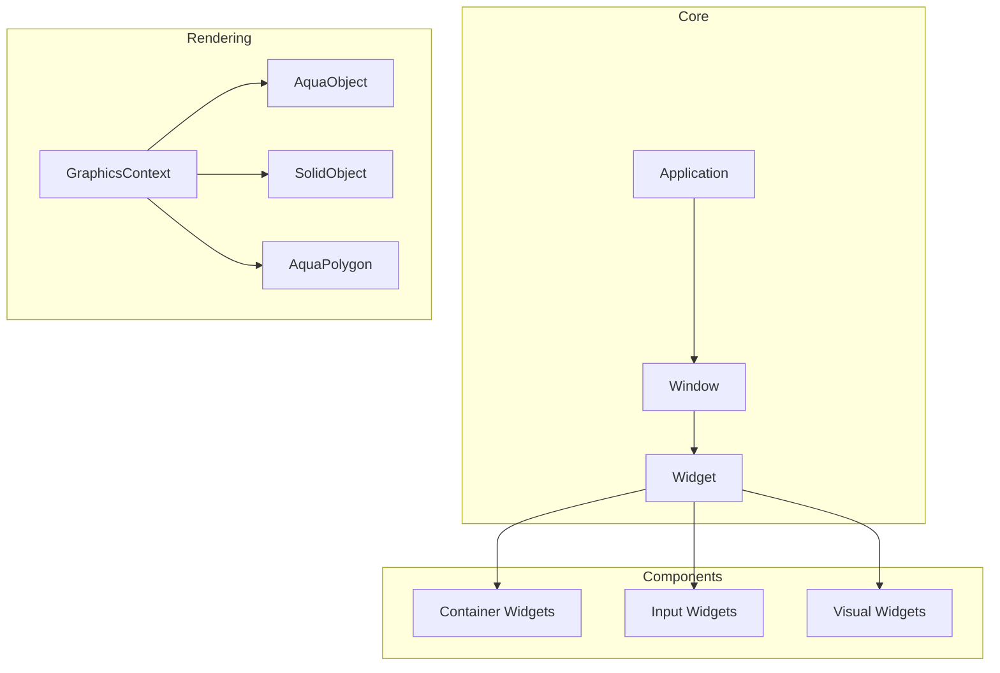
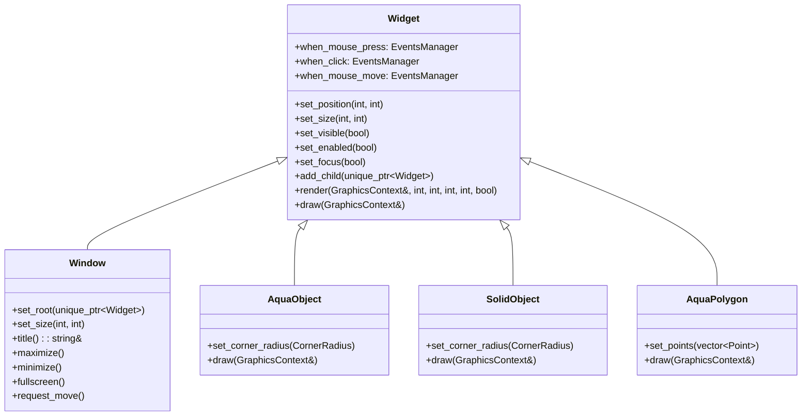
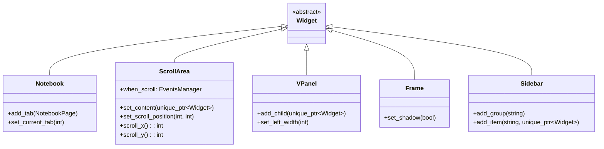
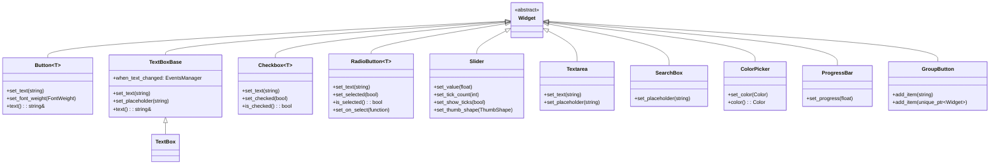
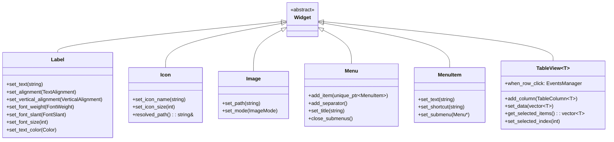
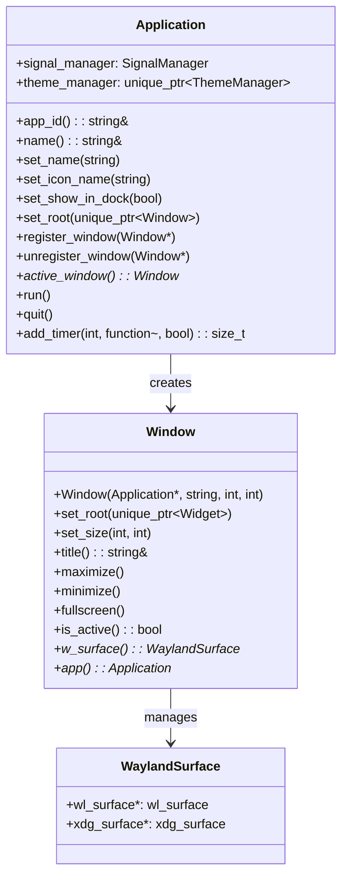
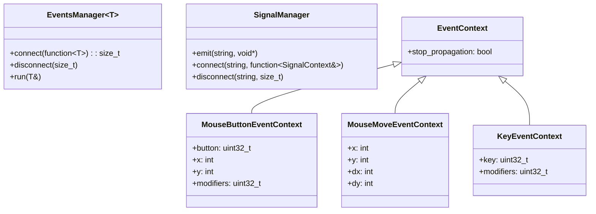
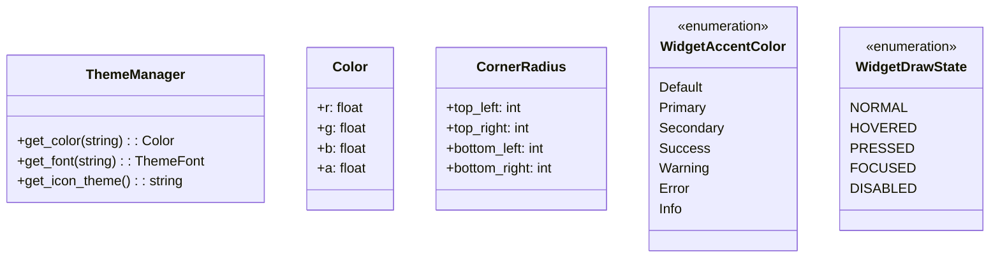
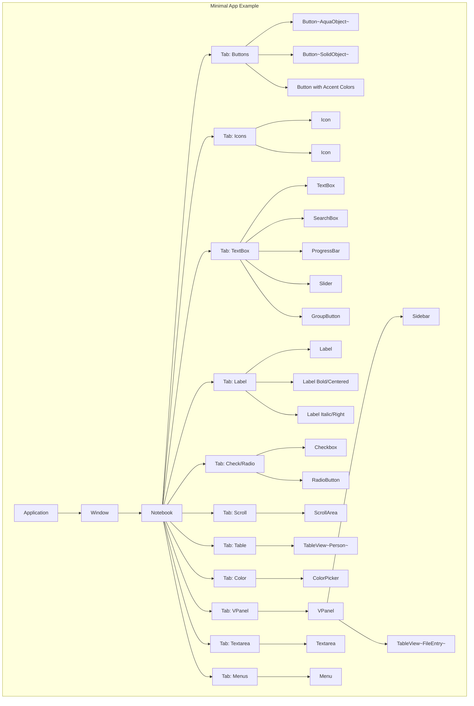
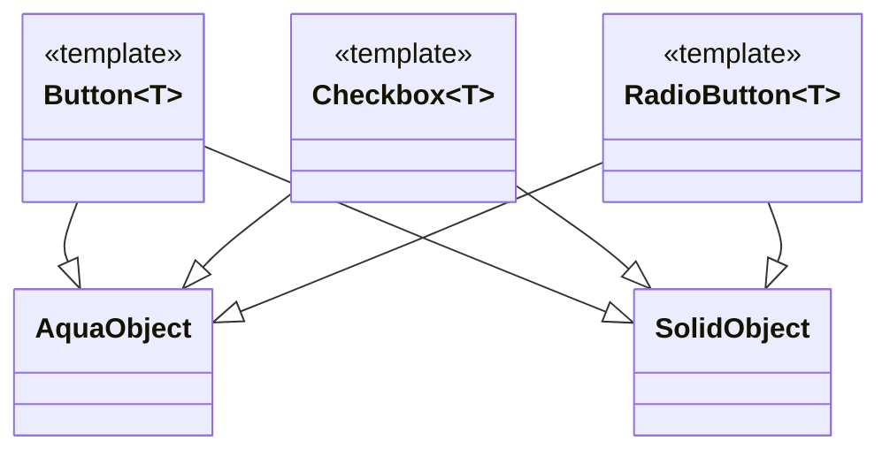

# Horizon Toolkit - UML Diagram

## Overview

Horizon es un toolkit de UI moderno diseñado para aplicaciones Wayland. Proporciona un conjunto completo de widgets y herramientas para crear interfaces gráficas de usuario estilo macOS/Aqua en entornos Linux con Wayland.

## Architecture Overview



## Class Hierarchy



## Widget Classes

### Container Widgets



### Input Widgets



### Visual Widgets



## Application Architecture



## Event System



## Theme & Styling



## Component Diagram - Example Usage



## Widget Factory Pattern



## Usage Example

```cpp
// Creating an application
Application app("horizon.minimal", 800, 600);
app.set_name("Minimal Demo");
app.set_icon_name("system-help");

// Creating a window
auto wnd = std::make_unique<Window>(&app, "Horizon Application");
wnd->set_size(800, 600);

// Adding widgets
auto notebook = std::make_unique<Notebook>();
auto container = std::make_unique<Widget>();
container->set_margin(10);
container->set_spacing(10);

auto btn = std::make_unique<Button<AquaObject>>();
btn->set_text("Aceptar");
btn->set_accent_color(WidgetAccentColor::Primary);

container->add_child(std::move(btn));
notebook->add_tab(NotebookPage("Buttons", "", std::move(container)));

wnd->add_child(std::move(notebook));
app.set_root(std::move(wnd));

app.run();
```

## Event Handling

Todos los widgets en Horizon proporcionan un sistema de eventos flexible mediante propiedades del tipo `when_nombre_del_evento`. Cada evento puede tener múltiples callbacks conectados mediante la función `connect()`.

### Eventos disponibles en Widget

| Evento | Descripción | Contexto |
|--------|-------------|----------|
| `when_mouse_press` | Se dispara al presionar un botón del mouse | MouseButtonEventContext |
| `when_mouse_release` | Se dispara al soltar un botón del mouse | MouseButtonEventContext |
| `when_click` | Se dispara al hacer click (presionar y soltar) | MouseButtonEventContext |
| `when_dbl_click` | Se dispara al hacer doble click | MouseButtonEventContext |
| `when_mouse_move` | Se dispara al mover el mouse sobre el widget | MouseMoveEventContext |
| `when_mouse_enter` | Se dispara cuando el mouse entra al widget | EventContext |
| `when_mouse_leave` | Se dispara cuando el mouse sale del widget | EventContext |
| `when_mouse_drag` | Se dispara al arrastrar el mouse | MouseMoveEventContext |
| `when_mouse_hover` | Se dispara cuando el mouse está sobre el widget | MouseMoveEventContext |
| `when_mouse_wheel` | Se dispara al usar la rueda del mouse | MouseWheelEventContext |
| `when_key_press` | Se dispara al presionar una tecla | KeyEventContext |
| `when_key_release` | Se dispara al soltar una tecla | KeyEventContext |
| `when_focus` | Se dispara cuando el widget recibe foco | EventContext |
| `when_blur` | Se dispara cuando el widget pierde foco | EventContext |

### Ejemplos de manejo de eventos

```cpp
// Click en un botón
btn->when_click.connect([](horizon::MouseButtonEventContext &ev) {
    LOG_INFO << "¡Botón presionado!";
    ev.stop_propagation = true; // Detener propagación del evento
});

// Presión del mouse (diferente a click)
btn->when_mouse_press.connect([&app](horizon::MouseButtonEventContext &ev) {
    LOG_INFO << "Mouse presionado en botón";
    // Emitir señal global
    app.signal_manager.emit("on_exit", &app);
});

// Movimiento del mouse
widget->when_mouse_move.connect([](horizon::MouseMoveEventContext &ev) {
    LOG_INFO << "Mouse en posición: " << ev.x << ", " << ev.y;
});

// Teclas
textbox->when_key_press.connect([](horizon::KeyEventContext &ev) {
    if (ev.key == 65307) { // ESC
        LOG_INFO << "Tecla ESC presionada";
    }
});

// Cambio de texto en TextBox
textbox->when_text_changed.connect([](horizon::KeyEventContext &ev) {
    LOG_INFO << "El texto ha cambiado";
});

// Scroll en ScrollArea
scroll_area->when_scroll.connect([](horizon::EventContext &ev) {
    LOG_INFO << "Scrolling detectado";
});

// Doble click en TableView
table_view->when_row_dbl_click.connect([](auto &ctx) {
    LOG_INFO << "Fila seleccionada: " << ctx.row_index;
    LOG_INFO << "Datos: " << ctx.row_data.name;
});

// Selección en Sidebar
sidebar->when_item_selected.connect([](horizon::EventContext &ev) {
    LOG_INFO << "Item de sidebar seleccionado";
});
```

### Señales globales con SignalManager

Para comunicación entre widgets o con la aplicación:

```cpp
// Conectar a una señal global
app.signal_manager.connect("on_exit", [](horizon::SignalContext &ctx) {
    LOG_INFO << "Signal 'on_exit' recibida. Cerrando aplicación.";
    exit(0);
});

// Emitir una señal desde cualquier widget
app.signal_manager.emit("on_exit", &app);
```

### Contextos de eventos

Cada tipo de evento proporciona un contexto con información específica:

- **EventContext**: Contexto base con `stop_propagation`
- **MouseButtonEventContext**: `button`, `x`, `y`, `modifiers`
- **MouseMoveEventContext**: `x`, `y`, `dx`, `dy`
- **KeyEventContext**: `key`, `modifiers`
- **SignalContext**: Datos asociados a la señal

## Key Features

1. **Wayland Native**: Built specifically for Wayland compositors
2. **Template-based Styling**: Widgets use templates (AquaObject, SolidObject) for different visual styles
3. **Event System**: Flexible multi-callback event system with propagation control
4. **Theme Support**: Centralized theme management through ThemeManager
5. **Container Widgets**: Complex layouts with Notebook, VPanel, ScrollArea
6. **Table Views**: Generic template-based TableView for data display
7. **Signal System**: Inter-widget communication through SignalManager

## Dependencies

- Wayland protocols (xdg-shell, layer-shell)
- OpenGL ES 2.0 / EGL for rendering
- Cairo for some graphics operations
- Standard C++17 features
