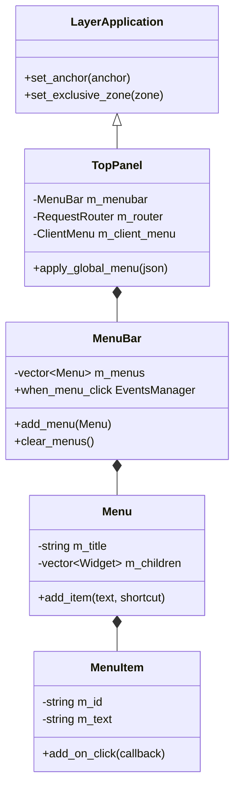
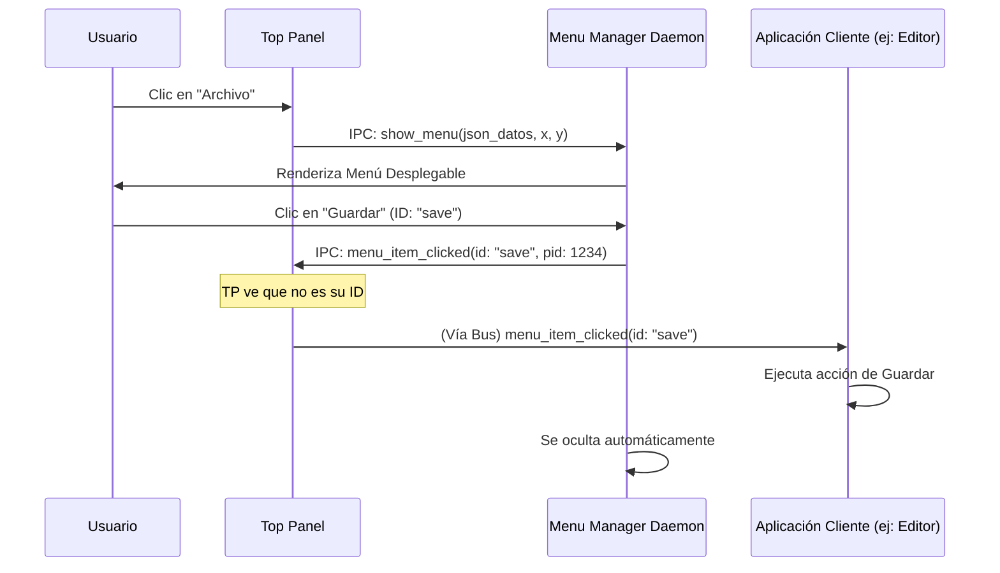

# Informe Técnico: Arquitectura y Funcionamiento de TopPanel

Este documento detalla el funcionamiento interno de la aplicación `top_panel` dentro del ecosistema Horizon, explicando la creación de la barra de menú, la gestión de menús globales y la distribución de eventos de clic.

## 1. Visión General de la Arquitectura

`top_panel` es una `LayerApplication` que se sitúa en la capa `TOP` de Wayland. Actúa como un host para menús dinámicos que cambian según la aplicación que tenga el foco en el sistema.

### Componentes Clave:
- **Top Panel (`main.cpp`)**: El punto de entrada y gestor de la interfaz de usuario de la barra superior.
- **MenuBar**: Widget que contiene múltiples objetos `Menu`.
- **Menu / MenuItem**: Estructuras de datos que representan los menús y sus elementos.
- **ClientMenu**: Clase auxiliar para enviar/recibir configuraciones de menú vía IPC.
- **Horizon Menu Manager Daemon (`horizon_menu_manager_d`)**: Aplicación auxiliar de nivel `OVERLAY` responsable de renderizar visualmente los menús desplegables fuera de la región de `top_panel`.
- **Horizon Session**: El bus central de mensajes (IPC) basado en un socket Unix (`/tmp/horizon_session.sock`).

---

## 2. Diagrama de Clases

El siguiente diagrama muestra la relación entre los componentes principales de `top_panel`.

---

## 3. Creación y Actualización de la Barra de Menú

### Inicialización
Al arrancar, `top_panel` configura su geometría como una franja de 32px en la parte superior:
1. Crea un `LayerApplication` con anclajes `TOP | LEFT | RIGHT`.
2. Define una zona exclusiva (`exclusive_zone`) de 32px para que otras ventanas no lo solapen.
3. Instancia un `MenuBar` y le añade un menú de sistema por defecto (el logo de Horizon).

### Menús Globales Dinámicos
La actualización de los menús ocurre mediante IPC. Cuando una aplicación Horizon (como un editor de texto) gana el foco:
1. La aplicación detecta que está activa (`Application::on_activated`).
2. Usa `ClientMenu::set_global_menu` para enviar su estructura de menú (en formato JSON) al socket `/tmp/horizon_session.sock`.
3. `top_panel` recibe el mensaje `set_global_menu`.
4. El `GlobalMenuMessage::parse` convierte el JSON en objetos `Menu` de C++.
5. `top_panel` limpia la `MenuBar` y añade los nuevos menús después del menú de sistema.

---

## 4. Distribución de Clics y Eventos

Debido a que `top_panel` es solo una barra delgada, no puede renderizar los menús desplegables sobre otras aplicaciones sin romper su zona exclusiva o crear artefactos visuales. Por ello, utiliza un "Daemon de Menús".

### Flujo de un Clic en la Barra de Menú:
1. El usuario hace clic en un título (ej: "Archivo") en `top_panel`.
2. `MenuBar` ejecuta el evento `when_menu_click`.
3. `top_panel` envía una solicitud `create_menu` a `horizon_menu_manager_d` vía IPC, incluyendo la estructura completa del menú y la posición (x, y).
4. `horizon_menu_manager_d` (que es una capa `OVERLAY` transparente que cubre toda la pantalla) despierta, se vuelve visible y renderiza el `Menu` en la posición indicada.

### Flujo de Clic en un Elemento de Menú (Item):
Cuando el usuario selecciona una opción (ej: "Guardar") dentro del menú desplegado por el Daemon:

1. `horizon_menu_manager_d` detecta el clic en el `MenuItem`.
2. El `MenuItem` tiene un handler que envía un mensaje IPC `menu_item_clicked` indicando el `id` del elemento y el `receiver_pid` (el PID de la aplicación dueña del menú).
3. **Casos de Distribución:**
   - **Acciones Propias**: Si el `id` es conocido por `top_panel` (ej: "run_terminal"), `top_panel` lo procesa directamente.
   - **Acciones de Aplicación**: Si el `id` es arbitrario (ej: "save_file"), el mensaje viaja por el bus IPC. Todas las aplicaciones escuchan, pero solo la que coincida con `receiver_pid` actúa (`Application::on_key_event` o similar, específicamente en el manejador de `menu_item_clicked` en `Application.cpp`).

### Diagrama de Secuencia: Distribución de Clic

---

## 5. Detalles de Implementación Técnicos

- **Timer Heartbeat**: `top_panel` usa un timer de 50ms para procesar mensajes de la cola de IPC de forma asíncrona sin bloquear el hilo de renderizado principal.
- **Race Condition Prevention**: Cuando `top_panel` pierde el foco porque el usuario hizo clic en la barra, existe una protección de 100ms (`clear_menu_timer_id`) para evitar que el menú desaparezca instantáneamente antes de que el Daemon pueda mostrarse.
- **Z-Order**: `top_panel` está en la capa `TOP` (2), mientras que `horizon_menu_manager_d` está en `OVERLAY` (3). Esto asegura que los menús desplegables siempre se dibujen *encima* de la barra y de cualquier otra ventana.
