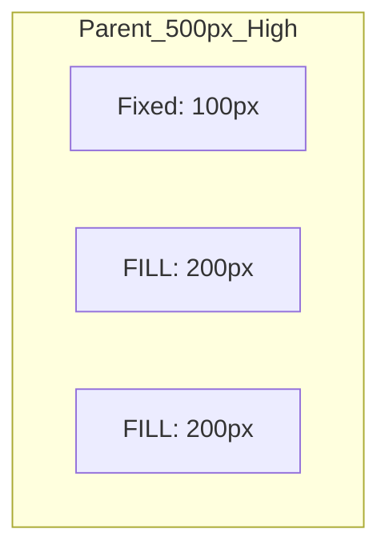
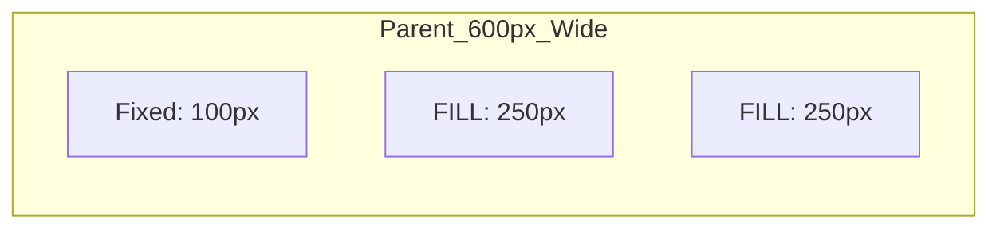
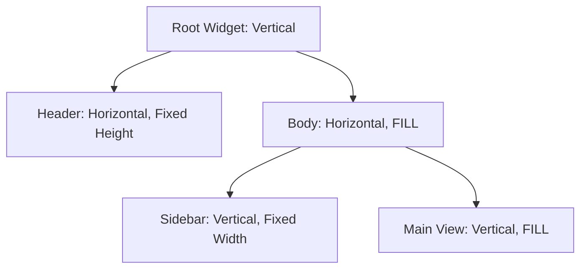

# 🧩 The Widget Class: Horizon's Core

The `Widget` class is the heart of the Horizon toolkit. Every UI element you see—buttons, labels, windows, and even the desktop itself—is a `Widget`. This guide will teach you how to build modern, responsive layouts from scratch using the Horizon philosophy.

---

## 🏗️ 1. Understanding Layouts

In Horizon, you don't usually set absolute pixel positions. Instead, you "nest" widgets inside each other to create a flow.

### Layout Types
A widget's **Layout Type** determines how it arranges its children.

| Layout Type | Behavior | Diagram |
| :--- | :--- | :--- |
| `WIDGET_LAYOUT_HORIZONTAL` | Children are placed side-by-side (Left to Right). | `[ A ][ B ][ C ]` |
| `WIDGET_LAYOUT_VERTICAL` | Children are stacked (Top to Bottom). | `[ A ]`<br>`[ B ]`<br>`[ C ]` |

### Position Types
How a widget behaves *inside* its parent's layout.

*   **`FILL` (Default)**: The widget expands to occupy available space.
*   **`FREE`**: The widget uses absolute coordinates (`set_position`).

---

## 📐 2. The Logic of Space Distribution

This is the most critical concept in Horizon. The engine calculates sizes based on "Remaining Space".

### The Golden Rule
1.  **Fixed First**: Horizon first subtracts the space taken by children with `set_fixed_size()`.
2.  **Divide the Rest**: The leftover space is divided **equally** among all `FILL` siblings.
3.  **Cross-Axis (Automatic Filling)**: 
    *   In a **Vertical** parent: All children automatically take the **full width**.
    *   In a **Horizontal** parent: All children automatically take the **full height**.

### Visual Example: Vertical Layout
Imagine a parent container that is **500px high**.

| Child | Configuration | Resulting Height | Resulting Width | Why? |
| :--- | :--- | :--- | :--- | :--- |
| **A** | `set_fixed_size(100)` | **100px** | 100% | It requested a fixed height. |
| **B** | `position_type(FILL)` | **200px** | 100% | Shares the remaining 400px with C. |
| **C** | `position_type(FILL)` | **200px** | 100% | Shares the remaining 400px with B. |



### Visual Example: Horizontal Layout
Imagine a parent container that is **600px wide**.



*   **Total Width**: 600px
*   **Minus Fixed (A)**: 600 - 100 = 500px remaining.
*   **B and C (FILL)**: 500 / 2 = 250px cada uno.

> [!TIP]
> Si quieres que un widget "desaparezca" o ocupe 0 espacio pero siga en el árbol, puedes usar `fixed_size(0)` o `set_visible(false)`.

---

## 🎨 2. Styling Properties

Every widget has a set of visual properties that can be adjusted to create the "Premium" Horizon look.

| Method | Description | Example |
| :--- | :--- | :--- |
| `set_background_color(Color)` | Fills the widget background. | `Color(1.0, 1.0, 1.0, 0.5)` |
| `set_border_radius(int)` | Rounds the corners (pixels). | `set_border_radius(12);` |
| `set_border_width(int)` | Sets the thickness of the border. | `set_border_width(1);` |
| `set_accent_color(Accent)` | Uses theme-defined colors. | `WidgetAccentColor::Primary` |
| `set_margin(int)` | Inner padding of the widget. | `set_margin(16);` |
| `set_spacing(int)` | Gap between children. | `set_spacing(8);` |

---

## ⚡ 3. Handling Events

Horizon uses an **Event Manager** system. To make a widget "do" something, you connect a function (lambda) to one of its event members.

### Interaction Events
| Event Name | Type | Description |
| :--- | :--- | :--- |
| `when_click` | `MouseButtonEventContext` | Triggered on a full Mouse Press + Release. |
| `when_dbl_click` | `MouseButtonEventContext` | Triggered on a quick double-click. |
| `when_right_click` | `MouseButtonEventContext` | Triggered on a right mouse button click. |
| `when_mouse_enter` | `EventContext` | Triggered when the mouse cursor enters the widget area. |
| `when_mouse_leave` | `EventContext` | Triggered when the mouse cursor leaves the widget area. |

### Movement & Mouse State
| Event Name | Type | Description |
| :--- | :--- | :--- |
| `when_mouse_press` | `MouseButtonEventContext` | Mouse button went down. |
| `when_mouse_release`| `MouseButtonEventContext` | Mouse button went up. |
| `when_mouse_move` | `MouseMoveEventContext` | Mouse moved inside the widget. |
| `when_mouse_drag` | `MouseMoveEventContext` | Mouse moved while holding a button. |
| `when_mouse_wheel` | `MouseWheelEventContext` | Mouse wheel was scrolled. |

### Keyboard & System
| Event Name | Type | Description |
| :--- | :--- | :--- |
| `when_key_press` | `KeyEventContext` | A key was pressed while the widget had focus. |
| `when_key_release` | `KeyEventContext` | A key was released. |
| `when_focus` | `EventContext` | Widget became the active input target. |
| `when_blur` | `EventContext` | Widget lost focus. |
| `when_application_load` | `EventContext` | Dispatched once the widget is fully attached and ready. |

---

## 🚀 4. Layout Example: Building a Sidebar

Let's combine everything to create a modern Sidebar layout.



```cpp
// 1. Create the root container
auto root = std::make_unique<Widget>();
root->set_layout_type(WIDGET_LAYOUT_VERTICAL);

// 2. Add a Header (Fixed Height)
auto header = std::make_unique<Widget>();
header->set_fixed_size(60); 
header->set_background_color({0, 0, 0, 0.2}); // Translucent black
root->add_child(std::move(header));

// 3. Add the Body container (Expands to take the rest of the height)
auto body = std::make_unique<Widget>();
body->set_layout_type(WIDGET_LAYOUT_HORIZONTAL);
body->set_position_type(FILL); 

// 4. Create a Sidebar (Fixed Width)
auto sidebar = std::make_unique<Widget>();
sidebar->set_fixed_size(200); 
sidebar->set_background_color({1, 1, 1, 0.1}); // Subtle glass effect
body->add_child(std::move(sidebar));

// 5. Create a Main View (Fills the remaining width)
auto main_view = std::make_unique<Widget>();
main_view->set_position_type(FILL);
body->add_child(std::move(main_view));

// Finally, add the body to the root
root->add_child(std::move(body));
```

---

## 💡 Best Practices

1.  **Favor `FILL` over fixed sizes**: This ensures your application looks good on both small laptops and large 4K monitors.
2.  **Use Spacers**: Use `Spacer()` to push widgets to the corners or center them without calculating pixels.
3.  **Invalidate when needed**: If you change a widget's property dynamically (like changing its color on the fly), call `invalidate()` to notify the renderer.
4.  **Ownership**: Remember that `add_child` takes a `unique_ptr`. Once you add a child, the parent owns it. Use raw pointers if you need to keep a reference to a child for later.
